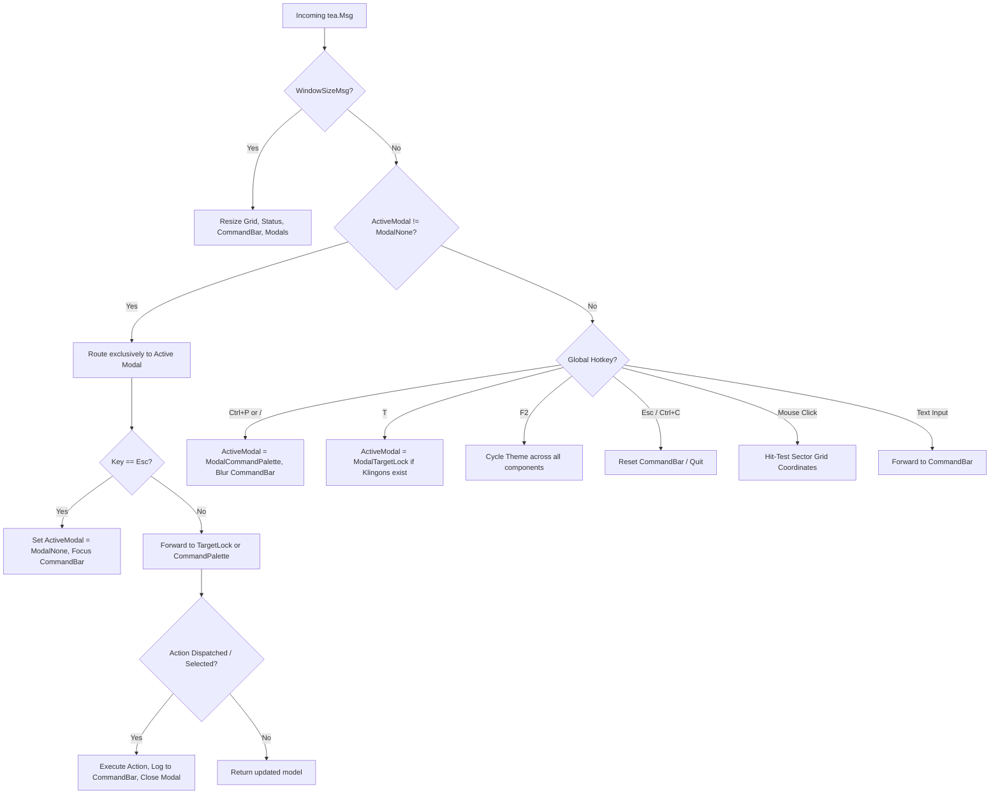

# Milestone 3 Design Specification: TUI Overlays & Mouse Targeting

**Date:** 2026-09-11  
**Status:** Approved  
**Target:** `pkg/tui` subsystem, `pkg/tui/components/targetlock`, `pkg/tui/components/commandpalette`, `pkg/tui/components/sectorgrid`  
**Parent RFC:** [#219](https://github.com/scottdensmore/super-star-trek/issues/219)  
**Parent Design Spec:** `docs/superpowers/specs/2026-09-10-go-charm-modernization-design.md`  

---

## 1. Executive Summary

Milestone 3 builds upon the Charmbracelet Split Dashboard and Theme Engine (delivered in Milestone 2) by introducing interactive floating overlays and mouse control:
1. **Target Lock HUD (`T` or Click Klingon)**: A tactical firing computer modal providing live computed range, bearing, and torpedo hit probability against hostile vessels, with instant quick-fire controls (`Enter` for torpedo, `P` for phasers, `Tab` to cycle targets).
2. **Spock Command Palette (`Ctrl+P` or `/`)**: A fuzzy-searchable modal command menu powered by `bubbles/list` cataloging all game commands, navigation options, tactical actions, and visual themes.
3. **Sector Grid Mouse Interaction**: Full mouse coordinate hit-testing mapping terminal click events to 8x8 sector cells, enabling click-to-target reticle highlighting, instant enemy targeting, and double-click impulse navigation.

All features strictly adhere to Bubble Tea's declarative Elm architecture, maintain 100% test coverage with the Go race detector (`-race`), preserve classic terminal backwards compatibility, and operate cleanly across Starfleet Modern, LCARS, and Phosphor CRT themes.

---

## 2. System Architecture & Modal Lifecycle

### 2.1 Modal State Machine
The root TUI model (`pkg/tui/model.go`) introduces a modal state discriminator:

```go
type ModalType int

const (
    ModalNone ModalType = iota
    ModalTargetLock
    ModalCommandPalette
)

type Model struct {
    Game           *engine.GameState
    Theme          theme.Theme
    Width          int
    Height         int
    Grid           sectorgrid.Model
    Status         statuspanel.Model
    CommandBar     commandbar.Model

    // Milestone 3 Additions:
    ActiveModal    ModalType
    TargetLock     targetlock.Model
    CommandPalette commandpalette.Model
    SelectedSector engine.Coord // Currently highlighted sector cell [1..8, 1..8]
    LastClickTime  time.Time    // Detects double-clicks (< 400ms threshold)
    LastClickCoord engine.Coord // Coordinate of preceding click
}
```

### 2.2 Event Routing Hierarchy (`pkg/tui/update.go`)
Every incoming Bubble Tea event (`tea.Msg`) is routed through a deterministic hierarchy:



### 2.3 Visual Compositing (`pkg/tui/view.go`)
1. If terminal dimensions are smaller than 80x24, the size notice is rendered.
2. Otherwise, `renderDashboard()` composes the base split dashboard (header, sector grid, telemetry status, and command bar).
3. If `ActiveModal == ModalNone`, the base dashboard string is returned.
4. If `ActiveModal != ModalNone`:
   - The modal view string is obtained from `TargetLock.View()` or `CommandPalette.View()`.
   - The modal dialog is centered over the screen using `lipgloss.Place(m.Width, m.Height, lipgloss.Center, lipgloss.Center, modalBox)`.

---

## 3. Target Lock HUD Component (`pkg/tui/components/targetlock`)

### 3.1 Responsibilities
Provides an authentic tactical weapons computer interface when engaging enemy vessels.

### 3.2 Target Telemetry & Ballistics Math
For Enterprise sector $E = (r_e, c_e)$ and target sector $K = (r_k, c_k)$:
- **Euclidean Distance**:
  $$\Delta = \sqrt{(r_k - r_e)^2 + (c_k - c_e)^2}$$
- **Bearing (Super Star Trek standard coordinate system)**:
  Measured in direction units from 1.0 to 9.0:
  - 1.0 = East, 2.0 = North-East, 3.0 = North, 4.0 = North-West
  - 5.0 = West, 6.0 = South-West, 7.0 = South, 8.0 = South-East
- **Torpedo Hit Probability**:
  $$P_{hit} = \max(0.10, \min(0.95, 1.0 - \frac{\Delta}{15.0}))$$
- **Target Cycling**:
  When multiple Klingons are present in the quadrant, all live targets from `g.CurrentQuad.Klingons` are loaded into an ordered slice sorted by distance. Pressing `Tab`, `Left`, or `Right` cycles between targets, updating telemetry instantaneously.

### 3.3 Target Lock Model & Messages
```go
package targetlock

type TargetInfo struct {
    KlingonID      int
    Coord          engine.Coord
    Distance       float64
    Bearing        float64
    HitProbability float64
    Power          float64
}

type Model struct {
    theme           theme.Theme
    targets         []TargetInfo
    targetIdx       int
    entEnergy       float64
    torpedoCount    int
    inputtingPhaser bool
    phaserInput     string
    warningMessage  string
}

// Emitted messages:
type FireTorpedoMsg struct {
    Target  engine.Coord
    Bearing float64
}

type FirePhasersMsg struct {
    Energy float64
}

type CloseHUDMsg struct{}
```

### 3.4 Keybindings
- **`Enter`**: Fires torpedo at active target. If `torpedoCount == 0`, flashes warning `*** NO TORPEDOES REMAINING ***`.
- **`P`**: Toggles phaser energy input prompt. Entering a valid numeric amount and pressing `Enter` fires phasers.
- **`Tab` / `Left` / `Right`**: Cycles active target index.
- **`Esc`**: Dismisses HUD without firing.

### 3.5 Visual Layout
Dimensions: 52 columns x 12 rows. Styled using `theme.Theme.Styles()`.

```
┌──────────────── TACTICAL TARGET LOCK ─────────────────┐
│ Target: KLINGON BATTLECRUISER #1                      │
│ Position: Sector [3, 6]                               │
│ Range: 3.61 sectors      Bearing: 2.34 (NE)          │
│ Hit Probability: 76%     Target Shielding: ~280 units │
├───────────────────────────────────────────────────────┤
│ Enterprise Weapons: [TORP: 8/10]  [ENERGY: 3450]      │
│                                                       │
│ [Enter] Fire Torpedo  [P] Phasers  [Tab] Next  [Esc]  │
└───────────────────────────────────────────────────────┘
```

---

## 4. Spock Command Palette Component (`pkg/tui/components/commandpalette`)

### 4.1 Responsibilities
Provides fuzzy command discovery and execution using Charm's `bubbles/list` component, invoked via `Ctrl+P` or `/`.

### 4.2 Item Catalog & Execution Types
Every catalog item specifies whether it requires user parameters or executes instantly:

| Label | Category | Description | Execution Type |
|---|---|---|---|
| `TOR` | Combat | Fire photon torpedo along bearing or sector (`tor <course|r c>`) | Parameterized (`tor `) |
| `PHA` | Combat | Fire ship phaser bank with energy (`pha <energy>`) | Parameterized (`pha `) |
| `SHE` | Combat | Transfer energy between warp and shields (`she <amount>`) | Parameterized (`she `) |
| `TARGET` | Combat | Open Tactical Target Lock HUD | Instant |
| `NAV` | Navigation | Impulse / Warp maneuver (`nav <course> <warp>`) | Parameterized (`nav `) |
| `DOC` | Navigation | Dock with adjacent Starbase for fuel & repair | Instant |
| `SRSCAN` | Sensors | Refresh short-range sensor tactical grid | Instant |
| `LRSCAN` | Sensors | Scan adjacent 3x3 quadrant cluster | Instant |
| `STATUS` | Reports | Review ship status, condition, and stardate | Instant |
| `DAM` | Reports | Review subsystem device damage repair times | Instant |
| `CHART` | Reports | Display explored galaxy quadrant chart | Instant |
| `THEME: Modern` | Settings | Switch theme to Starfleet Modern (Electric Cyan/Navy) | Instant |
| `THEME: LCARS` | Settings | Switch theme to 24th Century LCARS (Gold/Purple) | Instant |
| `THEME: CRT` | Settings | Switch theme to Phosphor Monochrome CRT (Green/Amber) | Instant |
| `HELP` | General | Display tactical command reference summary | Instant |
| `QUIT` | General | Abandon mission and exit to shell | Instant |

### 4.3 Command Palette Model & Messages
```go
package commandpalette

type PaletteItem struct {
    title         string
    desc          string
    commandPrefix string
    parameterized bool
}

type Model struct {
    theme  theme.Theme
    list   list.Model
    width  int
    height int
}

// Emitted messages:
type CommandSelectedMsg struct {
    CommandPrefix string
    Parameterized bool
}

type ClosePaletteMsg struct{}
```

### 4.4 Visual Layout
Dimensions: 56 columns x 16 rows. Centered floating box styled with active theme colors.

---

## 5. Sector Grid Mouse Hit-Testing & Interaction (`pkg/tui/components/sectorgrid`)

### 5.1 Character Geometry & Coordinate Mapping
The 8x8 sector grid has fixed layout bounds:
- **Vertical Offsets**:
  - `relY == 0`: Column headers (` 1   2   3   4   5   6   7   8 `)
  - `relY == 1`: Top grid border (` ┌───┬───┬...`)
  - Even lines `relY ∈ [2, 4, 6, 8, 10, 12, 14, 16]`: Sector cell content rows 1..8
  - Odd lines `relY ∈ [3, 5, 7, 9, 11, 13, 15, 17]`: Row separator borders (` ├───┼───┼...`)
- **Horizontal Offsets**:
  - Columns `0..2`: Row axis label (`1 │`, `2 │`, etc.)
  - Each cell occupies 3 characters followed by a 1-character vertical boundary:
    $$\text{Cell Column } c = \lfloor \frac{\text{relX} - 3}{4} \rfloor + 1$$
    $$\text{Cell Row } r = \frac{\text{relY} - 2}{2} + 1$$

`sectorgrid.Model` exposes:
```go
func (m Model) HitTest(relX, relY int) (engine.Coord, bool)
```
Returns `(coord, true)` if $(r, c) \in [1..8] \times [1..8]$ and the click landed on a cell line; returns `(Coord{}, false)` if clicked on border dividers or out of bounds.

### 5.2 Click Handling Rules
1. **Single Left-Click**:
   - Updates `m.SelectedSector = coord`.
   - **Klingon Cell (`+K+`)**: Immediately opens `ModalTargetLock` locked onto that Klingon.
   - **Other Cell**: Highlights cell with active reticle; logs `"Target sector selected: [r, c]"` to `CommandBar`.
2. **Double Left-Click (< 400ms threshold on same sector)**:
   - **Empty Cell (` . `)**: Automatically dispatches `engine.ActionMove{DestSector: coord, Warp: 1.0}`, logging maneuver events to `CommandBar`.
   - **Starbase Cell (`>B<`)**: If Enterprise is adjacent, dispatches `engine.ActionDock{}`.

### 5.3 Active Selection Reticle Rendering
`sectorgrid.Model.View` signature is enhanced:
```go
func (m Model) View(quad *engine.QuadrantState, entSector engine.Coord, selected engine.Coord) string
```
When a cell matches `selected`, its glyph is rendered with bracketed inverse styling (e.g. `[.]`, `[E]`, `[K]`), giving crisp visual confirmation of the targeted sector.

---

## 6. Error Handling & Edge Cases

1. **Target Lock When 0 Klingons in Quadrant**: Pressing `T` does not open the modal; logs `"Sensors detect no hostile targets in sector."` to the command bar.
2. **Depleted Torpedo Inventory**: Pressing `Enter` when torpedoes are 0 shows an inline warning within the modal without dismissing it.
3. **Phaser Energy Bounds**: Rejects inputs $\le 0$ or $> \text{Enterprise.Energy}$ with an inline error message.
4. **Terminal Resizing While Modal Active**: On `tea.WindowSizeMsg`, the modal dynamically recalibrates its center position and bounds.
5. **Terminals Without Mouse Support**: 100% of capabilities are accessible via hotkeys (`T`, `Ctrl+P`, `/`, `Tab`, arrows, `Enter`, `Esc`).

---

## 7. Verification & Testing Strategy

1. **Unit Testing (`pkg/tui/components/targetlock/targetlock_test.go`)**:
   - Verify distance, bearing, and hit probability formulas.
   - Verify target cycling (`Tab`, `Left`, `Right`).
   - Verify action emissions (`FireTorpedoMsg`, `FirePhasersMsg`, `CloseHUDMsg`).
2. **Unit Testing (`pkg/tui/components/commandpalette/commandpalette_test.go`)**:
   - Verify fuzzy filtering across all categories.
   - Verify selection distinction between parameterized vs instant actions.
   - Verify dismissal on `Esc`.
3. **Unit Testing (`pkg/tui/components/sectorgrid/grid_test.go`)**:
   - Full 64-cell hit-test table test including border and header bounds checking.
   - Reticle highlight rendering verification.
4. **Integration Testing (`pkg/tui/model_test.go`)**:
   - Synthetic event streams testing modal transitions, mouse click targeting, and theme switching while modals are active.
   - Full test suite passing with `go test -v -race ./...` (0 failures, 0 races).
   - Preserves C test gates (`ctest --preset debug`).
