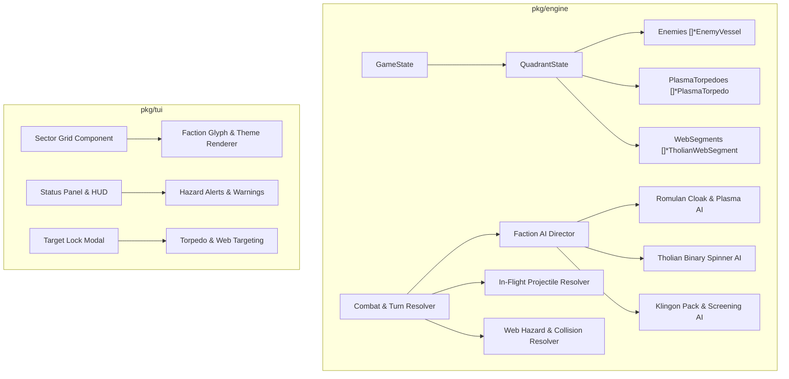
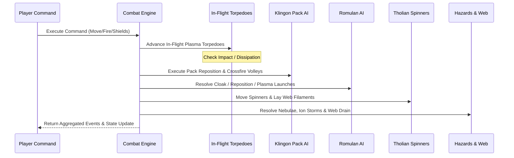

# Super Star Trek: Expanded Adversaries & Faction Tactics Design Specification

**Document:** `docs/superpowers/specs/2026-09-26-expanded-adversaries-faction-tactics-design.md`  
**Author:** Google DeepMind Pair Programming Assistant  
**Date:** September 26, 2026  
**Status:** Approved & Finalized  
**Implementation Target:** Sub-Project 2 of Roadmap (`v2.1.0`)

---

## 1. Executive Summary

This specification defines **Expanded Adversaries & Faction Tactics** for Super Star Trek. Building upon the foundational engine and Starfleet Career & Campaign Mode (Sub-Project 1), this feature introduces three distinct extraterrestrial adversary factions with unique tactical doctrines, weapon systems, hazard entities, and cooperative AI behaviors:

1. **Romulan Star Empire**:
   - High-technology cloaking devices with sensor distortion and stealth repositioning.
   - Long-range tracking **Plasma Torpedoes** as in-flight physical grid entities that advance toward the Enterprise each turn, dissipating heat over distance, and interceptable via phasers, photon torpedoes, or evasive maneuvers.
2. **Tholian Assembly**:
   - **Binary Web Spinners** operating in coordinated pairs.
   - Dynamic construction of **Tholian Web Filaments** across sector coordinates, trapping the Enterprise within an expanding energy perimeter that drains shields, inhibits impulse movement, and disables warp drives when closed.
3. **Klingon Pack Tactics**:
   - **Coordinated Crossfire Bracketing**: Multi-ship angular formations ($\ge 60^\circ$) granting a +35% damage bonus due to asymmetric shield deflection strain.
   - **Commander Screening**: Dedicated escort raiders dynamically repositioning into torpedo corridors to sacrifice themselves and protect their flagship Commanders.

These tactical systems are seamlessly integrated into Campaign Tour sectors (Romulans in the Neutral Zone, Tholians in border regions, Klingon wolf-packs in command sectors, and multi-faction fleet incursions in Sector 4), as well as standard games via high-difficulty profiles (`ProfileExpert`, `ProfileEmeritus`) or the `--adversaries` / `-a` CLI flag.

---

## 2. Architecture & Data Model



### 2.1 Entity Types & Board Constants
In [`pkg/engine/state.go`](file:///Users/scottdensmore/Developer/scottdensmore/super-star-trek/pkg/engine/state.go), `EntityType` is expanded:

```go
const (
	EntityEmpty EntityType = iota
	EntityEnterprise
	EntityKlingon
	EntityCommander
	EntitySuperCommander
	EntityStarbase
	EntityStar
	EntityPlanet
	EntityBlackHole
	EntityWormhole
	// Sub-Project 2: Tactical Faction Entities
	EntityRomulan        // "+R+" Romulan Bird of Prey / Warbird
	EntityTholian        // "<T>" Tholian Spinner
	EntityPlasmaTorpedo  // "*P*" In-flight tracking plasma projectile
	EntityTholianWeb     // ":::" Energy web filament
)
```

### 2.2 Faction Identification & Unified Ship Model
A unified enemy model encapsulates all vessel types while preserving backward compatibility with classic Klingon structures:

```go
type FactionType int

const (
	FactionKlingon FactionType = iota
	FactionRomulan
	FactionTholian
)

type EnemyVessel struct {
	ID           int         `json:"id"`
	Faction      FactionType `json:"faction"`
	Sector       Coord       `json:"sector"`
	Energy       float64     `json:"energy"`
	Shields      float64     `json:"shields"`
	MaxEnergy    float64     `json:"max_energy"`
	IsCommander  bool        `json:"is_commander"`
	IsCloaked    bool        `json:"is_cloaked"`
	CloakTurns   int         `json:"cloak_turns"`
	SpecialState int         `json:"special_state"` // Tholian spinner phase (0=Alpha, 1=Beta)
}
```

### 2.3 In-Flight Projectiles & Dynamic Web Filaments
```go
type PlasmaTorpedo struct {
	ID            int     `json:"id"`
	SourceID      int     `json:"source_id"` // ID of the firing vessel
	Sector        Coord   `json:"sector"`    // Current coordinate
	Energy        float64 `json:"energy"`    // Remaining thermal yield (cools ~20%/turn)
	TargetSector  Coord   `json:"target"`    // Target coordinate (Enterprise)
	TurnsInFlight int     `json:"turns"`     // Max lifespan (typically 5 turns)
}

type TholianWebSegment struct {
	Coord    Coord   `json:"coord"`    // Grid coordinate occupied by web
	Strength float64 `json:"strength"` // Structural integrity (default: 250.0)
}
```

### 2.4 Quadrant State Container
```go
type QuadrantState struct {
	Grid            [9][9]EntityType     `json:"grid"`
	Enemies         []*EnemyVessel       `json:"enemies"`
	PlasmaTorpedoes []*PlasmaTorpedo     `json:"plasma_torpedoes,omitempty"`
	WebSegments     []*TholianWebSegment `json:"web_segments,omitempty"`
	Starbase        *Coord               `json:"starbase,omitempty"`
	Stars           []Coord              `json:"stars,omitempty"`
	
	// Backward-compatibility accessor slice:
	Klingons        []*Klingon           `json:"-"`
}
```

---

## 3. Faction Tactics & Behavioral AI

### 3.1 Romulan Star Empire

#### Cloak & Sensor Distortion
1. **Sensory Masking**:
   - When `IsCloaked == true`, the Romulan does not appear as `EntityRomulan` on Short-Range Sensors; the grid cell displays as empty space.
   - Long-Range Sensors and Tachyon Sweeps detect an anomalous sensor echo (`"?"`).
2. **Tactical Repositioning**:
   - While cloaked, Romulans calculate an optimal strike standoff distance (2 to 4 sectors from Enterprise) and reposition silently each turn.
   - Romulans cannot fire while cloaked.
3. **Decloak & Strike**:
   - When in position, the Romulan decloaks, emitting an `EventRomulanDecloak`, and unleashes either standard disruptors or a heavy Plasma Torpedo.

#### Plasma Torpedo Ballistics & Counterplay
1. **Launch**:
   - Romulan decloaks and fires a `PlasmaTorpedo` (initial yield: 1,000–1,400 energy, depending on difficulty/sector).
2. **Turn-Based Tracking**:
   - Each turn during `AdvanceProjectiles()`, the torpedo traverses 1 to 2 grid units toward the Enterprise's current coordinate using Bresenham / vector step interpolation, routing around obstacles where possible.
3. **Dissipation**:
   - The torpedo loses 20% of its initial yield per turn. If energy falls below 200 or `TurnsInFlight >= 5`, it safely dissipates into background vacuum (`EventPlasmaDissipated`).
4. **Impact**:
   - On impact with Enterprise: 50% absorbed by shields, 50% penetrating directly to hull and subsystem devices, triggering severe fire hazards.
5. **Player Interception**:
   - **Phaser Point-Defense**: Firing phasers at the plasma torpedo coordinate (`phaser <energy> <target>`) delivers immediate beam energy. If beam damage $\ge$ torpedo energy, the plasma ball detonates harmlessly in space (`EventPlasmaIntercepted`).
   - **Photon Torpedo**: A direct torpedo hit instantly explodes the plasma projectile.
   - **Evasion**: Impulse movement or warp jumps that widen the distance allow the torpedo to expire before reaching the ship.

---

### 3.2 Tholian Assembly

#### Binary Web Spinners
- Tholian spinners spawn in bonded pairs: **Spinner Alpha** and **Spinner Beta**.
- **Perimeter Traversal**:
  - Spinners establish perimeter waypoints surrounding the Enterprise.
  - Each turn, each spinner moves along the perimeter and deposits a `TholianWebSegment` (`Strength: 250.0`) in the cell it departs.
  - Over 6–8 turns, the woven filaments form a closed geometric boundary.

#### Web Interdiction & Containment
- **Impulse Collision**:
  - Attempting to impulse through a web segment halts the Enterprise and discharges 400–600 shield energy (or structural hull damage if unshielded).
- **Warp Interdiction**:
  - If the web perimeter is completely closed (100% containment enclosure), warp drive coils are locked out; warp jumps cannot be engaged until a breach is opened.
- **Counterplay & Destruction**:
  - **Breaching**: Torpedo or phaser fire directed at a web cell deals damage to `TholianWebSegment.Strength`. At $\le 0$ strength, the segment is destroyed, creating a path to escape.
  - **Decapitation**: Destroying one Tholian slows web generation by 50%. Destroying both spinners triggers an immediate cascade failure that vaporizes all active web filaments in the quadrant.

---

### 3.3 Klingon Pack Tactics

#### Coordinated Crossfire Bracketing
- **Formation Geometry**:
  - The tactical director computes angular vectors from all active Klingon vessels to the Enterprise:
    $$\theta_{ij} = \arccos\left(\frac{\vec{v}_i \cdot \vec{v}_j}{\|\vec{v}_i\| \|\vec{v}_j\|}\right)$$
  - If two or more Klingons have line-of-sight and are separated by an angle $\theta \ge 60^\circ$, they enter a **Crossfire Bracket**.
- **Damage Multiplier**:
  - Synchronized attacks from bracketed vessels inflict a **+35% damage multiplier**, simulating the Enterprise's inability to angle directional shield harmonics against opposing vectors.

#### Commander Screening (Bodyguard Maneuver)
- When a Klingon Commander is in the quadrant, escort raiders assess the Enterprise's direct torpedo firing corridors.
- If a clear firing corridor exists between the Enterprise and the Commander, an escort raider will proactively burn impulse movement to step into the corridor, intercepting the torpedo and shielding the Commander.

---

## 4. Turn Resolution Cycle

All tactical actions resolve in a deterministic turn order at the end of each player command:



---

## 5. Campaign, Difficulty & Persistence Integration

### 5.1 Campaign Patrol Tour Slices
- **Sector 1 (*Neutral Zone Patrol*)**: Romulan patrol incursions. Introduces cloaking tactics and plasma torpedo evasion.
- **Sector 2 (*Border Outpost Defense*)**: Tholian territorial dispute. Tholian Spinners actively attempt to encircle Starbases and the Enterprise.
- **Sector 3 (*Commander Decapitation*)**: Elite Klingon battle group. Employs advanced pack crossfire bracketing and raider escort screening.
- **Sector 4 (*Invasion Fleet Interception*)**: Grand coalition fleet. Super-Commanders flanked by Romulan stealth heavy cruisers and Tholian area-denial spinners.

### 5.2 Difficulty Profiles & CLI Options
- **Classic 1971 Mode**: 100% faithful backward compatibility. Only classic Klingons appear.
- **Difficulty Profiles**:
  - `ProfileNormal`: Classic enemies.
  - `ProfileExpert` & `ProfileEmeritus`: Romulans and Klingon pack tactics enabled in standard games.
- **CLI Flag**: `sst --adversaries` (or `sst -a`) enables Romulans and Tholians in any standard sandbox game.

### 5.3 Scoring & Medals
- **Destruction Points**:
  - Klingon Raider: `+10 pts`
  - Klingon Commander: `+50 pts`
  - Klingon Super-Commander: `+200 pts`
  - Romulan Bird-of-Prey: `+20 pts`
  - Tholian Web Spinner: `+35 pts`
  - Plasma Torpedo Intercepted: `+10 pts`
  - Web Filament Destroyed: `+5 pts`
- **New Tour Commendations**:
  - *Praetor's Bane Citation*: Neutralized 5+ Romulan vessels without suffering unshielded plasma hull damage.
  - *Web Weaver's Nemesis*: Destroyed a Tholian Spinner pair before perimeter containment reached 50%.
  - *Ironclad Tactical Citation*: Survived a 3-ship Klingon crossfire bracket without shield failure.

### 5.4 Save/Load Backward Compatibility
- Dual-state `SaveEnvelope` serializes `Enemies`, `PlasmaTorpedoes`, and `WebSegments` with `omitempty`.
- Mid-combat saves preserve exact projectile tracking vectors, dissipation levels, and active web filament matrices.
- Legacy saves automatically populate with empty slices, initializing default Klingon vessels without schema errors.

---

## 6. TUI Presentation, Visual Themes & Controls

### 6.1 Sector Grid Glyphs by Visual Theme

| Entity | Modern | LCARS | CRT | Meaning |
|---|---|---|---|---|
| **Romulan Raider** | `+R+` (Emerald) | `ROM` (Amber/Purple) | `+R+` (Phosphor Green) | Romulan Warbird / Raider |
| **Sensor Echo** | `?R?` (Dim Cyan) | `???` (Muted Blue) | `?R?` (Dim Green) | Cloaked tachyon disturbance |
| **Tholian Spinner** | `<T>` (Cyan) | `THO` (Bright Gold) | `<T>` (Amber/Yellow) | Binary web weaver |
| **Tholian Web** | `:::` (Bright Cyan) | `═══` (Gold mesh) | `:::` (High-intensity Green) | Web filament barrier |
| **Plasma Torpedo** | `*P*` (Glowing Coral) | `PLZ` (Bright Orange) | `*P*` (Blinking Phosphor) | In-flight tracking projectile |

### 6.2 Status Panel HUD Badges
When quadrant hazards are active, [`pkg/tui/components/statuspanel/`](file:///Users/scottdensmore/Developer/scottdensmore/super-star-trek/pkg/tui/components/statuspanel/) displays high-priority warning indicators:
- `⚠️ INCOMING PLASMA TORPEDO [Sector 4,5 | Range 2 | Yield 850]`
- `⚠️ THOLIAN WEB EXPANDING [Containment: 55% | Warp Inhibited]`
- `⚠️ CROSSFIRE BRACKET ACTIVE [Flank Angle: 85° | Hostiles: 2 | +35% Vulnerability]`

### 6.3 Player Point-Defense Commands
- `phaser <energy> <r,c>`: Directs focused phaser fire at coordinate `[r,c]` to intercept incoming plasma torpedoes or disintegrate web segments.
- `torpedo <r,c>`: Launches photon torpedo at coordinate `[r,c]` to detonate plasma balls or blast an escape breach in web filaments.
- **Target Lock Modal (`t`)**: Fully supports targeting active plasma torpedoes and web segments in the target cycling list.

---

## 7. Testing Strategy

1. **Unit Tests (`pkg/engine/tactics_test.go`)**:
   - Cloak state transitions and sensor masking.
   - Plasma torpedo in-flight vector calculation, turn dissipation, and impact damage.
   - Tholian binary web weaving, containment calculation, and spinner destruction cascades.
   - Klingon angular crossfire calculations and commander shielding maneuvers.
2. **Interception & Point-Defense Tests**:
   - Phaser beam neutralization of in-flight plasma torpedoes.
   - Torpedo breaching of web filaments.
3. **Persistence & Migration Tests (`pkg/engine/save_test.go`)**:
   - Serialization and deserialization of mid-flight plasma torpedoes and web layouts.
   - Backward compatibility loading legacy v1.x and v2.0 save games.
4. **TUI Presentation & Interaction Tests (`pkg/tui/` and `tests/`)**:
   - Verification of glyph rendering across Modern, LCARS, and CRT themes.
   - Status panel warning badge rendering.
   - Target lock modal target cycling for projectiles and web nodes.
   - End-to-end integration scenario testing multi-faction combat.

---

## 8. Success Criteria

- 100% pure standard library Go for core engine logic (`CGO_ENABLED=0`).
- Backward compatibility: Classic single games and existing scenarios run unaffected.
- 100% test passing rate across `go test -race ./...` and `go vet ./...`.
- Deterministic gameplay reproducibility with seeded PRNG.
